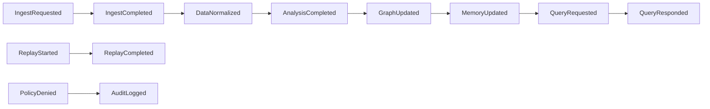

# AegisTwin Event Schema

**Version:** 1.0.0  
**Last Updated:** 2026-01-06

---

## Overview

AegisTwin uses an event-driven architecture where all inter-module communication happens through typed events. This document describes the event contract that all modules must follow.

## Event Flow



## Base Event

All events inherit from `BaseEvent` which provides:

| Field | Type | Description |
|-------|------|-------------|
| `event_id` | `str` | Unique identifier (UUID) |
| `event_type` | `EventType` | Type enum value |
| `timestamp` | `datetime` | When the event was created |
| `run_id` | `str` | Pipeline run identifier |
| `parent_event_id` | `str?` | ID of triggering event |
| `metadata` | `dict` | Additional context |
| `payload_hash` | `str` | Deterministic hash for replay |

---

## Pipeline Events

### IngestRequested

Emitted when data ingestion is requested.

```python
IngestRequested(
    source="email",           # Data source identifier
    data_type="messages",     # Type of data
    payload={"records": []},  # Data to ingest
    connector_id="email_v1"   # Optional connector ID
)
```

### IngestCompleted

Emitted when ingestion completes successfully.

```python
IngestCompleted(
    source="email",
    record_count=150,
    ingest_request_id="abc123",
    duration_ms=45.2
)
```

### DataNormalized

Emitted when data has been normalized.

```python
DataNormalized(
    source="email",
    normalized_records=[...],
    schema_version="1.0.0",
    transformations_applied=["lowercase", "timestamp_normalize"]
)
```

### AnalysisCompleted

Emitted when analysis completes.

```python
AnalysisCompleted(
    analysis_type="sentiment_and_entity",
    results={"sentiment": {"positive": 0.7}},
    confidence=0.85,
    entities_extracted=[{"type": "person", "name": "Alex"}],
    relationships_found=[{"source": "Alex", "target": "Jordan", "type": "knows"}]
)
```

### GraphUpdated

Emitted when the knowledge graph is updated.

```python
GraphUpdated(
    nodes_added=5,
    edges_added=3,
    nodes_updated=2,
    graph_version="42"
)
```

### MemoryUpdated

Emitted when memory systems are updated.

```python
MemoryUpdated(
    memory_type="episodic",  # episodic, semantic, or procedural
    entries_added=10,
    entries_consolidated=2,
    memory_state_hash="abc123"
)
```

---

## Query Events

### QueryRequested

Emitted when a query is submitted.

```python
QueryRequested(
    query_text="What topics were discussed last week?",
    query_type="search",  # search, inference, aggregation
    context={"time_range": "7d"},
    requester_id="user_123"
)
```

### QueryResponded

Emitted when a query response is ready.

```python
QueryResponded(
    query_request_id="query_abc",
    response={"answer": "The main topics were...", "topics": [...]},
    sources=["memory_graph", "knowledge_base"],
    confidence=0.85,
    latency_ms=32.1
)
```

---

## Governance Events

### AuditLogged

Emitted for audit logging.

```python
AuditLogged(
    action="export",
    actor="user_123",
    resource="user_pii",
    outcome="denied",
    policy_id="deny-pii-export",
    reason="PII export is not permitted"
)
```

### PolicyDenied

Emitted when a policy denies an action.

```python
PolicyDenied(
    action="execute",
    policy_id="deny-forbidden-modules",
    reason="System modules are restricted",
    suggested_action="Use approved modules instead"
)
```

---

## Replay Events

### ReplayStarted

Emitted when a replay session begins.

```python
ReplayStarted(
    original_run_id="abc123",
    replay_mode="verify",  # verify, debug, compare
    event_count=42
)
```

### ReplayCompleted

Emitted when replay completes.

```python
ReplayCompleted(
    original_run_id="abc123",
    events_replayed=42,
    events_matched=42,
    events_diverged=0,
    divergence_details=[]
)
```

---

## Payload Hash

Every event has a computed `payload_hash` field that provides a deterministic hash of the event's content (excluding volatile fields like `event_id` and `timestamp`). This enables:

1. **Replay Verification**: Compare hashes to detect divergence
2. **Deduplication**: Identify identical events
3. **Audit Trail**: Prove event content hasn't changed

```python
event = IngestCompleted(source="email", record_count=10, ...)
print(event.payload_hash)  # "a1b2c3d4e5f6..."
```

---

## Event Serialization

Events serialize to JSON for storage and transmission:

```python
event = IngestRequested(source="email", data_type="messages", payload={})
json_str = event.model_dump_json()
```

Trace format (for `trace.json`):

```json
{
  "event_id": "550e8400-e29b-41d4-a716-446655440000",
  "event_type": "ingest.requested",
  "timestamp": "2026-01-06T15:30:00Z",
  "run_id": "abc123",
  "parent_event_id": null,
  "payload_hash": "a1b2c3d4"
}
```

---

## Creating Custom Events

To create a custom event:

```python
from aegistwin.events.schema import BaseEvent, EventType

class MyCustomEvent(BaseEvent):
    event_type: EventType = EventType.CUSTOM  # Add to enum first
    my_field: str
    my_data: dict
```

## Non-Negotiables

- All events are **immutable** after creation
- All events must have a valid `event_type`
- Parent event chains must be preserved for tracing
- Payload hashes must be deterministic
