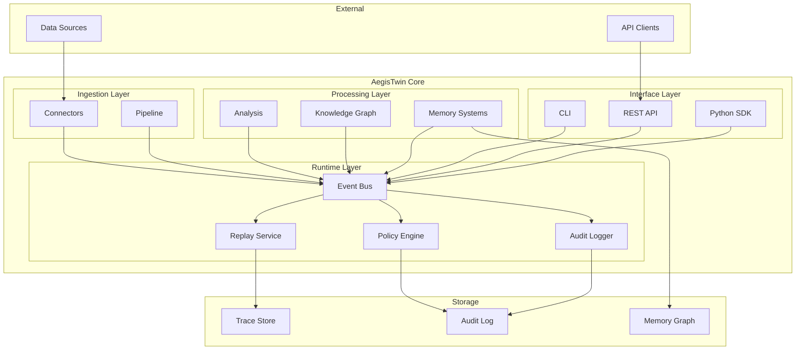

# AegisTwin Architecture

**Version:** 1.0.0  
**Last Updated:** 2026-01-06

---

## Overview

AegisTwin is an event-driven agent runtime that provides governance, deterministic replay, and local memory graph capabilities. This document describes the system architecture.

## High-Level Architecture



## Component Details

### Event Bus

The central nervous system of AegisTwin. All inter-module communication flows through typed events.

**Responsibilities:**
- Route events to subscribers
- Record events for replay
- Maintain parent-child event chains

**Key Properties:**
- Events are immutable
- Events have deterministic payload hashes
- Events are serializable to JSON

### Policy Engine

Enforces access control and governance rules.

**Responsibilities:**
- Evaluate policies before actions
- Deny forbidden operations
- Log all policy decisions

**Policy Structure:**
```yaml
policies:
  - id: deny-pii-export
    action: export
    resource: "*pii*"
    effect: deny
    reason: "PII export not permitted"
    priority: 999
```

### Replay Service

Enables deterministic replay of previous runs.

**Responsibilities:**
- Record event traces during runs
- Replay events from traces
- Compare replay results with originals
- Report divergences

**Replay Modes:**
- `verify` — Check if replay matches original
- `debug` — Step through events with inspection
- `compare` — Side-by-side comparison

### Memory Systems

Three-tier memory architecture:

1. **Episodic Memory** — Specific events and experiences
2. **Semantic Memory** — Facts and relationships (Knowledge Graph)
3. **Procedural Memory** — Learned patterns and behaviors

### Connectors

Adapters for various data sources:

- Email (IMAP, Exchange)
- Calendar (iCal, Google)
- Messages (various formats)
- Social (activity data)

## Data Flow

### Ingestion Pipeline

```
Data Source → Connector → Ingest Event → Pipeline → Normalize Event
     → Analysis → Analyze Event → Graph Update → Memory Update
```

### Query Flow

```
Query Request → Policy Check → Memory Search → Graph Query
     → Response Assembly → Query Response Event
```

### Replay Flow

```
Load Trace → Replay Start Event → Re-execute Events
     → Compare Hashes → Replay Complete Event
```

## Event Types

| Event | Description |
|-------|-------------|
| `IngestRequested` | Data ingestion requested |
| `IngestCompleted` | Ingestion finished |
| `DataNormalized` | Data normalized to schema |
| `AnalysisCompleted` | Analysis finished |
| `GraphUpdated` | Knowledge graph updated |
| `MemoryUpdated` | Memory systems updated |
| `QueryRequested` | Query submitted |
| `QueryResponded` | Query answered |
| `PolicyDenied` | Action denied by policy |
| `AuditLogged` | Audit entry created |
| `ReplayStarted` | Replay session started |
| `ReplayCompleted` | Replay session finished |

## Security Model

### Defense in Depth

1. **Policy Layer** — Configurable rules for access control
2. **Forbidden List** — Hardcoded deny for dangerous operations
3. **Audit Trail** — All actions logged with actor/action/resource
4. **PII Protection** — Scanner prevents sensitive data leakage

### Forbidden Operations

These operations are always denied regardless of policy:
- `system.shell` — Shell execution
- `system.exec` — Arbitrary code execution
- `network.external` — External network access
- `data.export_pii` — PII export

## Deployment Options

### Standalone

```bash
pip install aegistwin
aegistwin demo
```

### As Service

```bash
uvicorn aegistwin.api:app --host 0.0.0.0 --port 8000
```

### Embedded SDK

```python
from aegistwin import AegisTwin
twin = AegisTwin(config_path="my_config.yaml")
```

## Configuration

Default configuration can be overridden via YAML:

```yaml
# aegistwin.yaml
runs_dir: "./runs"
enable_replay: true
enable_audit: true
policy_mode: "enforce"  # enforce, warn, disabled
max_events_per_run: 10000
```

## Scalability Considerations

Current implementation is designed for single-process use. For scaling:

1. **Event Bus** — Replace with message queue (Redis, RabbitMQ)
2. **Memory Graph** — Replace with graph database (Neo4j)
3. **Trace Store** — Replace with time-series database
4. **Policy Engine** — Add distributed cache for policies

## Dependencies

### Core

- `pydantic` >= 2.0 — Event schema validation
- `fastapi` >= 0.100 — REST API
- `pyyaml` >= 6.0 — Configuration

### Optional

- `networkx` — Graph operations
- `sentence-transformers` — Semantic search
- `numpy` — Numerical operations
